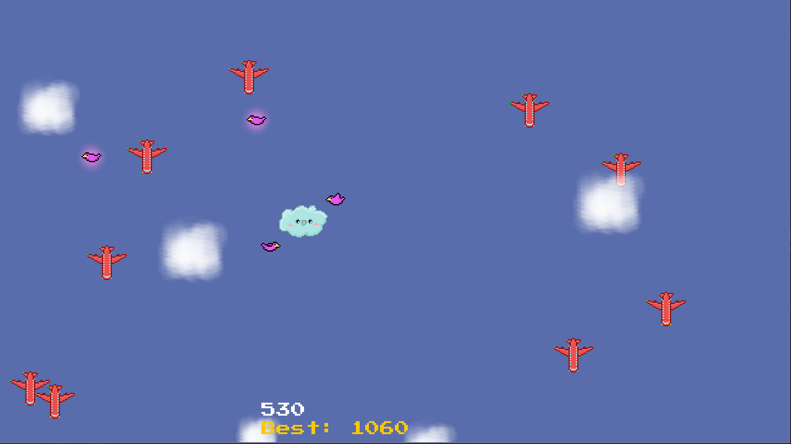

Fluffy is a cloud who doesn’t like airplanes flying through her.
You can move her out of their way to keep her safe.
The longer she avoids collision, the more points you earn.
Birds are Fluffy’s friends. When collected, they circle around her and act as a protective shield.

This game was a school project developed from September 2023 to January 2024.
I created it in my free time over five months.
Alongside the game, I also wrote a detailed tutorial designed to help beginners
with no programming experience create a simpler version of it.
The tutorial is currently not public,
as it was part of a school submission and I don’t hold the rights to distribute it.

**Special features**

- scaleable window
- birds rotate in circle
- animated objects

# Try it your self

Latest release can be found on GitHub under [Releases](https://github.com/deanqx/Fluffy/releases).

1. Download the `.jar` file

2. Run it with Java

## Controls

| Key        | Action                       |
|------------|------------------------------|
| `w` or `↑` | move up                      |
| `a` or `←` | move left                    |
| `s` or `↓` | move down                    |
| `d` or `→` | move right                   |
| `g`        | debug mode, display hitboxes |

## Run from source

### Linux or OSX system

```
./gradlew run
```

### Windows PowerShell

```
gradlew.bat run
```

# For developers

This project uses [Gradle](https://docs.gradle.org/current/userguide/getting_started.html)
as build system.

This project uses the default formatter of `jdtls` language server.

## Build

Before building a new release the version number has to be updated in the `build.gradle.kts` file.

The [application plugin](https://docs.gradle.org/current/userguide/application_plugin.html)
is used to build.

### JAR

```
./gradlew installDist
```

### Publish ready ZIP

```
./gradlew distZip
```
